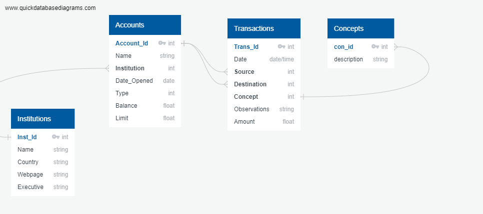

# Project Description

* This app allows the user to keep track of all their financial needs, bank accounts balance, credit information, investments, budgets
* It keeps all records in a lightweight database (SQLite)
* The user interface uses html and javascript
* All the calculations, information retrieval and graphs are done in Python

# Database design

* The ERD is created using [QuickDatabase Diagrams](www.quickdatabasediagrams.com)

## Accounts database

